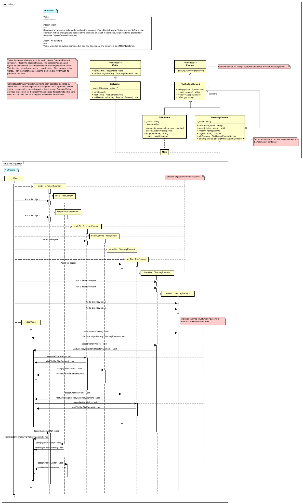
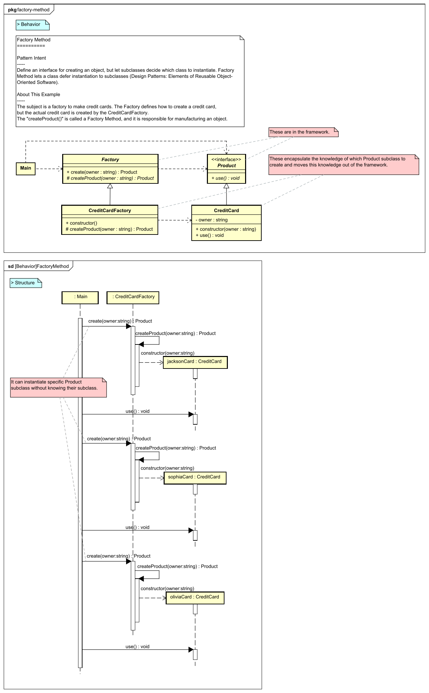
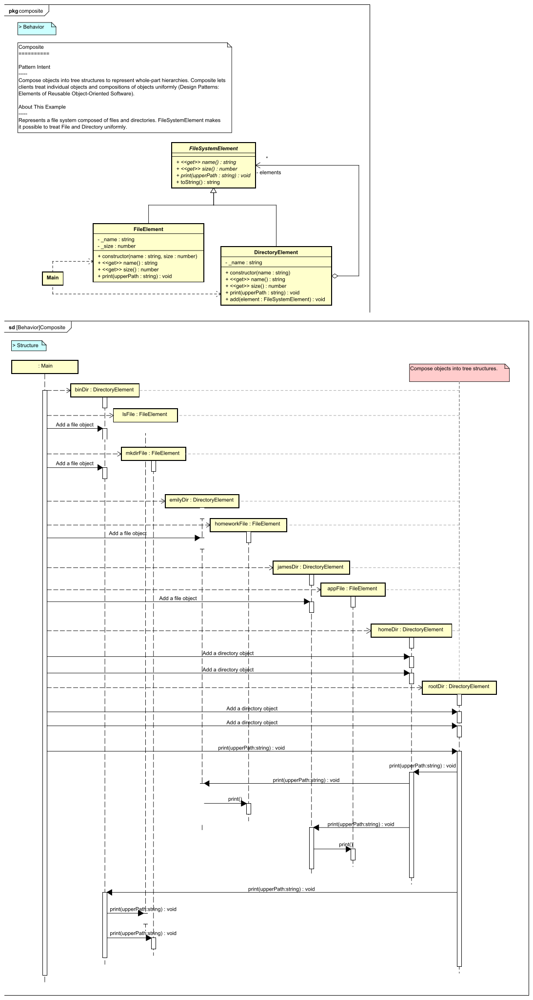
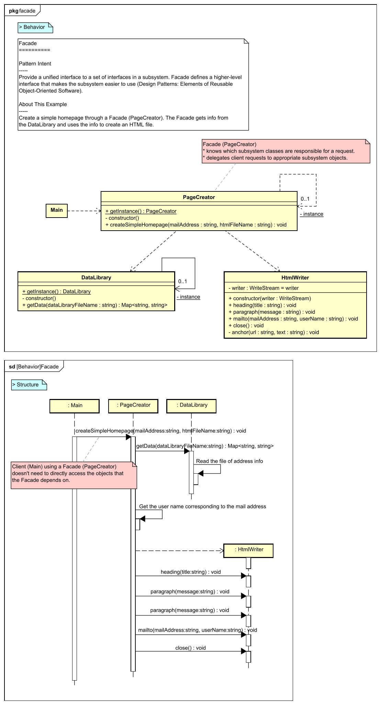
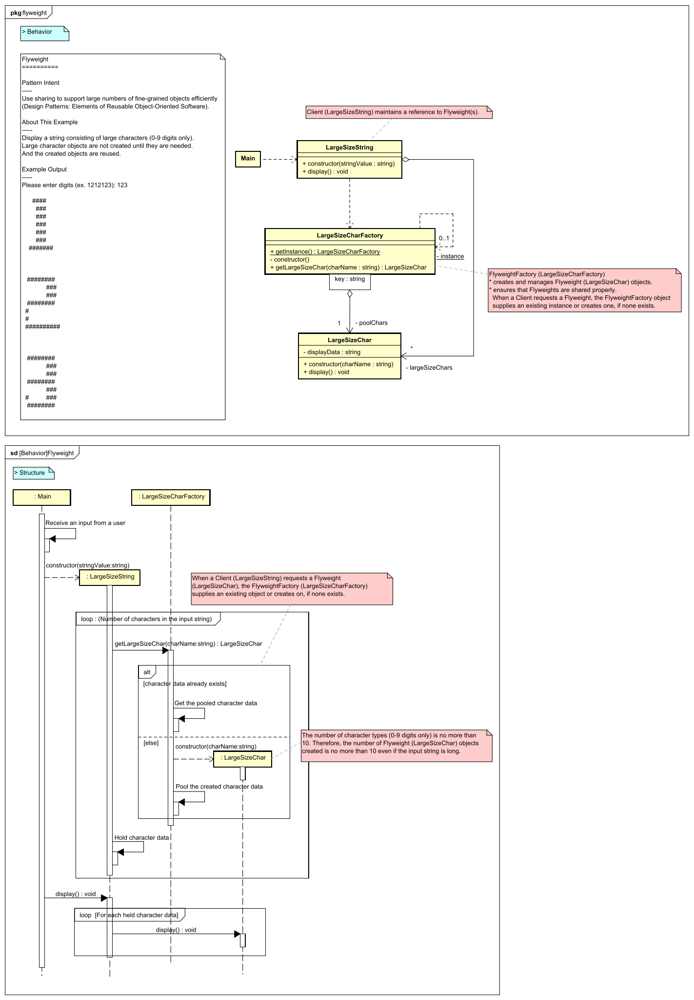

UML Diagram for Typescript Design Pattern Examples
===

This project lists UML diagrams of the "[Design Pattern Examples in Typescript](https://github.com/takaakit/design-pattern-examples-in-typescript)". When you click on a diagram image, the diagram will be opened in **Diagram Map**. If you want to know about Diagram Map, see [this post](https://dev.to/takaakit/diagram-map-tracing-uml-sysml-elements-across-diagrams-49i7).

Behavioral Patterns
---
|  |  |  |
| :---: | :---: | :---: |
| **Chain of Responsibility** | **Command** | **Interpreter** |
|  <a href="https://github.com/takaakit/design-pattern-examples-in-typescript/tree/master/behavioral-patterns/chain-of-responsibility">Typescript Code</a> <a href="./behavioral-patterns/chain-of-responsibility/ExecutionResult.png">Execution Result</a> |  <a href="https://github.com/takaakit/design-pattern-examples-in-typescript/tree/master/behavioral-patterns/command">Typescript Code</a> <a href="./behavioral-patterns/command/ExecutionResult.png">Execution Result</a> |  <a href="https://github.com/takaakit/design-pattern-examples-in-typescript/tree/master/behavioral-patterns/interpreter">Typescript Code</a> <a href="./behavioral-patterns/interpreter/ExecutionResult.png">Execution Result</a> |
| **Iterator** | **Mediator** | **Memento** |
|  <a href="https://github.com/takaakit/design-pattern-examples-in-typescript/tree/master/behavioral-patterns/iterator">Typescript Code</a> <a href="./behavioral-patterns/iterator/ExecutionResult.png">Execution Result</a> |  <a href="https://github.com/takaakit/design-pattern-examples-in-typescript/tree/master/behavioral-patterns/mediator">Typescript Code</a> <a href="./behavioral-patterns/mediator/ExecutionResult.png">Execution Result</a> |  <a href="https://github.com/takaakit/design-pattern-examples-in-typescript/tree/master/behavioral-patterns/memento">Typescript Code</a> <a href="./behavioral-patterns/memento/ExecutionResult.png">Execution Result</a> |
| **Observer** | **State** | **Strategy** |
|  <a href="https://github.com/takaakit/design-pattern-examples-in-typescript/tree/master/behavioral-patterns/observer">Typescript Code</a> <a href="./behavioral-patterns/observer/ExecutionResult.png">Execution Result</a> |  <a href="https://github.com/takaakit/design-pattern-examples-in-typescript/tree/master/behavioral-patterns/state">Typescript Code</a> <a href="./behavioral-patterns/state/ExecutionResult.png">Execution Result</a> |  <a href="https://github.com/takaakit/design-pattern-examples-in-typescript/tree/master/behavioral-patterns/strategy">Typescript Code</a> <a href="./behavioral-patterns/strategy/ExecutionResult.png">Execution Result</a> |
| **Template Method** | **Visitor** |  |
|  <a href="https://github.com/takaakit/design-pattern-examples-in-typescript/tree/master/behavioral-patterns/template-method">Typescript Code</a> <a href="./behavioral-patterns/template-method/ExecutionResult.png">Execution Result</a> |  <a href="https://github.com/takaakit/design-pattern-examples-in-typescript/tree/master/behavioral-patterns/visitor">Typescript Code</a> <a href="./behavioral-patterns/visitor/ExecutionResult.png">Execution Result</a> |  |

Creational Patterns
---
|  |  |  |
| :---: | :---: | :---: |
| **Abstract Factory** | **Builder** | **Factory Method** |
|  <a href="https://github.com/takaakit/design-pattern-examples-in-typescript/tree/master/creational-patterns/abstract-factory">Typescript Code</a> <a href="./creational-patterns/abstract-factory/ExecutionResult.png">Execution Result</a> |  <a href="https://github.com/takaakit/design-pattern-examples-in-typescript/tree/master/creational-patterns/builder">Typescript Code</a> <a href="./creational-patterns/builder/ExecutionResult.png">Execution Result</a> |  <a href="https://github.com/takaakit/design-pattern-examples-in-typescript/tree/master/creational-patterns/factory-method">Typescript Code</a> <a href="./creational-patterns/factory-method/ExecutionResult.png">Execution Result</a> |
| **Prototype** | **Singleton** |  |
|  <a href="https://github.com/takaakit/design-pattern-examples-in-typescript/tree/master/creational-patterns/prototype">Typescript Code</a> <a href="./creational-patterns/prototype/ExecutionResult.png">Execution Result</a> |  <a href="https://github.com/takaakit/design-pattern-examples-in-typescript/tree/master/creational-patterns/singleton">Typescript Code</a> <a href="./creational-patterns/singleton/ExecutionResult.png">Execution Result</a> |  |

Structural Patterns
---
|  |  |  |
| :---: | :---: | :---: |
| **Adapter** | **Bridge** | **Composite** |
|  <a href="https://github.com/takaakit/design-pattern-examples-in-typescript/tree/master/structural-patterns/adapter">Typescript Code</a> <a href="./structural-patterns/adapter/ExecutionResult.png">Execution Result</a> |  <a href="https://github.com/takaakit/design-pattern-examples-in-typescript/tree/master/structural-patterns/bridge">Typescript Code</a> <a href="./structural-patterns/bridge/ExecutionResult.png">Execution Result</a> |  <a href="https://github.com/takaakit/design-pattern-examples-in-typescript/tree/master/structural-patterns/composite">Typescript Code</a> <a href="./structural-patterns/composite/ExecutionResult.png">Execution Result</a> |
| **Decorator** | **Facade** | **Flyweight** |
|  <a href="https://github.com/takaakit/design-pattern-examples-in-typescript/tree/master/structural-patterns/decorator">Typescript Code</a> <a href="./structural-patterns/decorator/ExecutionResult.png">Execution Result</a> |  <a href="https://github.com/takaakit/design-pattern-examples-in-typescript/tree/master/structural-patterns/facade">Typescript Code</a> <a href="./structural-patterns/facade/ExecutionResult.png">Execution Result</a> |  <a href="https://github.com/takaakit/design-pattern-examples-in-typescript/tree/master/structural-patterns/flyweight">Typescript Code</a> <a href="./structural-patterns/flyweight/ExecutionResult.png">Execution Result</a> |
| **Proxy** |  |  |
|  <a href="https://github.com/takaakit/design-pattern-examples-in-typescript/tree/master/structural-patterns/proxy">Typescript Code</a> <a href="./structural-patterns/proxy/ExecutionResult.png">Execution Result</a> | | |

References
---
* Gamma, E. et al. Design Patterns: Elements of Reusable Object-Oriented Software, Addison-Wesley, 1994
* Hiroshi Yuki. Learning Design Patterns in Java [In Japanese Language], Softbank publishing, 2004

Links
---
* [Design Pattern Examples in Typescript](https://github.com/takaakit/design-pattern-examples-in-typescript)
* [Diagram Map: tracing UML/SysML elements across diagrams](https://dev.to/takaakit/diagram-map-tracing-uml-sysml-elements-across-diagrams-49i7)

Licence
---
Diagram Map file (DiagramMap.html) includes the following libraries:
* [D3 library](https://d3js.org) is copyrighted by Mike Bostock and is released under the [BSD license](https://opensource.org/licenses/BSD-3-Clause).
* [Popper library](https://popper.js.org/) is copyrighted by Federico Zivolo and is released under the [MIT license](https://opensource.org/licenses/MIT).
* [Tippy library](https://atomiks.github.io/tippyjs/) is copyrighted by atomiks and is released under the [MIT license](https://opensource.org/licenses/MIT).

Files and data in this project other than the above libraries are under the [Creative Commons Zero (CC0) license](https://creativecommons.org/publicdomain/zero/1.0/).
